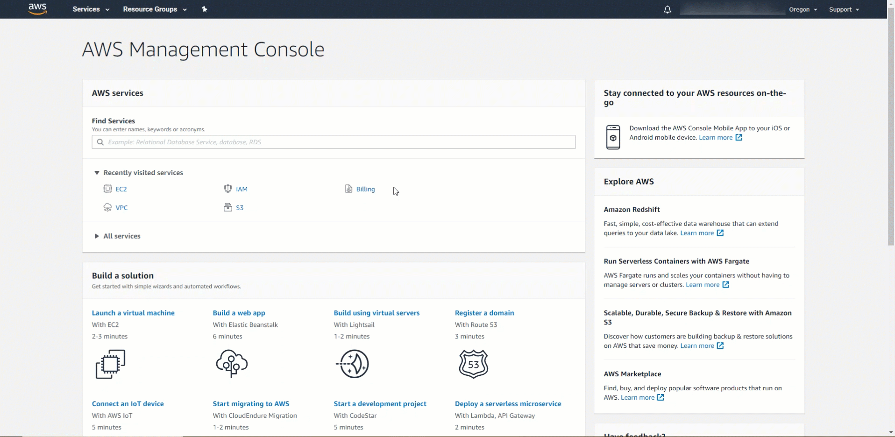

# Getting Started
Postgres Deployment scripts are an easy way to deploy Postgres and EDB Tools at no charge. It is a contribution by the EDB team members which can help people explore both Postgres and EDB tools. Users can interact via the git repository comments section. Feel free to leave comments there. However, these scripts are not officially supported by the EnterpriseDb Team.

EnterpriseDB has the largest base of PostgreSQL experts available.

Learn more about [Professional Support] (https://www.enterprisedb.com/services/ongoing-postgresql-help/postgresql-technical-support)

The intention of this repository is as an introductory self starting guide for setting up the prerequisites needed to install and configure Postgres or EnterpriseDB Postgres Advanced Server in GCP.

Before starting to delve into this repository, it is best to get familiar with the steps in the deployment process towards GCP.

## The overall process consists of the following steps:

1. Set up Software Prerequisites
   * Accomplished manually
   * Requires configuration of AWS CLI for authentication towards AWS
   * [Installing AWS Command Line Interface] (https://docs.aws.amazon.com/cli/latest/userguide/cli-chap-install.html)
   * [Terraform Installation]  (https://learn.hashicorp.com/tutorials/terraform/install-cli)
   * Download the Code for this repository by navigating to the top of this page and clicking on: **Code** Green Button -> **Download ZIP** Link
   * Type: ```edb-tf-aws``` and press **Enter**

----
### Supported Operating Systems
* Centos 7
* RedHat 7

----
### Software Prerequisites
1. AWS CLI
2. Terraform >= 0.13

**Require Manual Installation**
* [Installing AWS Command Line Interface] (https://docs.aws.amazon.com/cli/latest/userguide/cli-chap-install.html)
* [Terraform Installation]  (https://learn.hashicorp.com/tutorials/terraform/install-cli)
* Download the Code for this repository by navigating to the top of this page and clicking on: **Code** Green Button -> **Download ZIP** Link
* Type: ```edb-tf-aws``` and press **Enter**

----
### Prerequisites Setup and configuration
##### Dependencies
* AWS CLI v2 Installation
  
* AWS CLI Configuration
  
* AWS Key Pair File Generation
  
* Terraform 0.13 Installation
  
* Download the Code for this repository by navigating to the top of this page and clicking on: **Code** Green Button -> **Download ZIP** Link
* Type: ```edb-tf-aws``` and press **Enter**

----
### Changing the Image from the current: CentOS 7 to a different image
* To change the image: Navigate to the ```environments/ec2/ec2.tf``` file
* Determine if you should uncomment line 18 or line 20 to match either ```Centos 7``` or ```RHEL 7```
* Evaluate if there is a need to change the size of the hdd on line 29
* Determine if there is a need to change the ```volume_type``` on line 30

----
### Changing the tags for the entire Cluster resources
* To change the prefixes and name of the tags: Navigate to the ```tags.tf``` file

----
### Prerequisites Setup

**Steps**

* Create a key pair in the AWS EC2 Console -> Services -> EC2 -> Network & Security -> Key Pairs -> Create key pair

* Copy the recently created key pair file to a location that will be utilized in the steps below 

* Download the Code for this repository by navigating to the top of this page and clicking on: **Code** Green Button -> **Download ZIP** Link

* Type: ```edb-tf-aws``` and press **Enter**

* Update the ```variables.tf``` with the key pair file and other desired settings

* Terraform must be initialized

* Set variables in the **```variables.tf```** file according to your desired configuration

* Variables to set:

   * ```aws_region``` - AWS Region for the resources to be created
   * ```instance_count``` - Initially set to 3, update if more are needed. Keep in mind that if there are previous configurations on these instances all those configurations and updates will be lost
   * ```cluster_name``` - Name for the cluster, examples: ```Dev```, ```QA``` or ```Prod```
   * ```ssh_keypair``` - Name of the key pair file only, no need to include the '.pem' file extension
   * ```ssh_key_path``` - Directory and File Location for the key pair file
   
* Review the naming conventions utilized in the **```variables.tf```** file and update accordingly

* Before applying the changes you can preview those changes with **terraform plan**

* Create resources in Account with **terraform apply**

* The variables listed above must be provided when the **terraform plan** or **terraform apply** command are executed

Once the terraform apply has completed you should see a list resources within your ```Console``` that resemble the list below:
* 1 VPC Network
* 3 Subnets
* 1 Route Table
* 1 Internet Gateway
* 1 Security Group with Rules
* 3 Virtual Machines

**Terraform Commands**

Initialize terraform.

```
$ terraform init
```

Assess what resources will be created with this command.

```
$ terraform plan
```

Create the resources.

```
$ terraform apply
```

Verify which resources were created.

```
$ terraform show
```

To destroy resources recently created.

```
$ terraform destroy
```

----
### Verify which resources were created
1. Login into the [AWS Console]  (https://console.aws.amazon.com)
2. Locate and click the following services within the AWS Console: IAM, VPC, EC2
3. Locate the desired resources to view under their respective section
