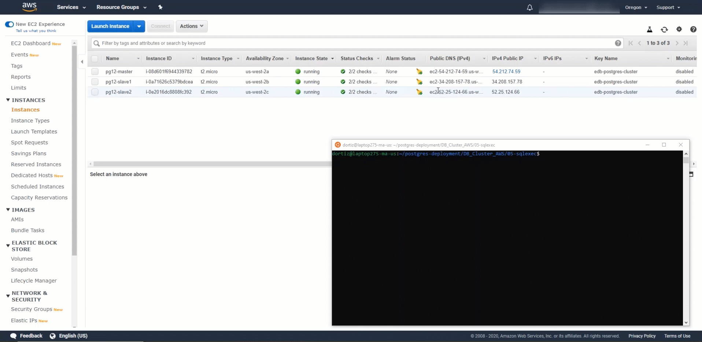

# Getting Started
Postgres Deployment scripts are an easy way to deploy Postgres and EDB Tools at no charge. It is a contribution by the EDB team members which can help people explore both Postgres and EDB tools. Users can interact via the git repository comments section. Feel free to leave comments there. However, these scripts are not officially supported by the EnterpriseDb Team.

EnterpriseDb has the largest base of PostgreSQL experts available.

Learn more about [Professional Support] (https://www.enterprisedb.com/services/ongoing-postgresql-help/postgresql-technical-support)

The intention of this repository is as an introductory self starting guide.

Before starting to delve into this repository, it is best to get familiar with the steps in the deployment process towards Amazon Web Services.

## The overall process consists of the following steps:

1. Set up Software Prerequisites
   * Accomplished manually
   * Requires configuration of AWS Command Line Interface for authentication towards AWS
   * [Configuring the AWS CLI]
(https://docs.aws.amazon.com/cli/latest/userguide/cli-chap-configure.html)
2. Set up AWS Prerequites resources in Cloud Vendors such as: AWS, GCP and Azure
   * Performed by Terraform scripts in "01-prerequisites-terraform" folder
4. Setup Postgres or EnterpriseDB Postgres Advanced Server
   * Performed by Ansible scripts in repository available at: [edb-ansible](https://github.com/EnterpriseDB/edb-ansible)
5. Execute SQL Scripts
   * Performed by Ansible scripts in "02-sqlexec" folder
----
### Demo Tutorials
* [Prerequisites Video - 01-prereqs](03-demos/) 
* [Postgres SQL Exec Video - 02-SQLExec](03-demos/) 


----
### Skipping Steps
* If you already have Prerequisites matching the ```Prerequisites``` step you can skip to the ```Install Postgres or EnterpriseDB Postgres Advanced Server``` step.

----
### Software Prerequisites
1. Terraform installed
2. Ansible installed

**Require Manual Installation**

* [Terraform Installation]  (https://learn.hashicorp.com/terraform/getting-started/install.html)

* [Ansible Installation] (https://docs.ansible.com/ansible/latest/installation_guide/intro_installation.html)

### Prerequisites Setup
##### Dependencies
1. Terraform

### Components
1. 1 VPC, VPN or Project in your Cloud account
2. Minimum of 3 Subnets with Public IP enabled
3. Minimum of 3 Instances

**Steps**

* Terraform must be initialized

* Navigate to the **01-prereqs-terraform** folder

* Set variables in the **```variables.tf```** file to match your desired settings

* Variables to set:

   * **Refer to the ```README.md``` within the cloud vendor being utilized**
     * [AWS](https://github.com/EnterpriseDB/postgres-deployment/tree/dev/DB_Cluster/01-prereqs-terraform/edb-tf-aws)
     * [GCP](https://github.com/EnterpriseDB/postgres-deployment/tree/dev/DB_Cluster/01-prereqs-terraform/edb-tf-gcp)
     * [Azure](https://github.com/EnterpriseDB/postgres-deployment/tree/dev/DB_Cluster/01-prereqs-terraform/edb-tf-azure)

* Create resources in AWS VPC with **terraform plan** or **terraform apply**

* AWS region must be provided when the **terraform plan** or **terraform apply** command are executed


**Terraform Commands**

Initialize terraform.

```
$ terraform init
```

Assess what resources will be created with this command.

```
$ terraform plan
```

Create the resources in AWS.

```
$ terraform apply
```

Verify which resources were created.

```
$ terraform show
```

To destroy resources recently created.

```
$ terraform destroy
```


### Execute SQL Statements on Postgres Cluster
##### Dependencies
1. Ansible
2. Prerequisites
3. Postgres Instances
4. Installation of Postgres on Instances

### Components
1. 1 VPC, VPN or Project in your Cloud account
2. Minimum of 3 Subnets
3. Previously existing Security Rules for Instances with Inbound and Outbound Rules
4. Minimum of 3 Instances 

**Steps**

* Navigate to the **02-sqlexec** folder

* Refer to the example files: ```hosts.yml``` and ```playbook.yml``` located in the ```02-sqlexec``` directory

* Example of ansible command line parameters:

   * ansible-playbook playbook.yml -u <user> --private-key '<keyfilename>.pem'
