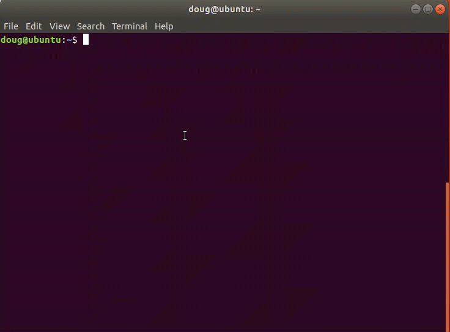

# Getting Started
Postgres Deployment scripts are an easy way to deploy Postgres and EDB Tools at no charge. It is a contribution by the EDB team members which can help people explore both Postgres and EDB tools. Users can interact via the git repository comments section. Feel free to leave comments there. However, these scripts are not officially supported by the EnterpriseDb Team.

EnterpriseDb has the largest base of PostgreSQL experts available.

Learn more about [Professional Support] (https://www.enterprisedb.com/services/ongoing-postgresql-help/postgresql-technical-support)

The intention of this repository is as an introductory self starting guide.

Before starting to delve into this repository, it is best to get familiar with the steps in the deployment process towards Amazon Web Services.

## The overall process consists of the following steps:

1. Set up Software Prerequisites
   * Linux based Operating System
   * Package dependencies installation are accomplished via bash script
   * Cloud Vendor SDK or CLI installed via bash script
   * Requires configuration of Cloud Vendor SDK or Command Line Interface for authentication
2. Configure Cloud Vendor SDK or CLI with credentials
3. Create Cloud Infrastructure Prerequisites Resources in Cloud Vendors such as: AWS, GCP and Azure
   * Performed by Terraform scripts in ```01-prerequisites-terraform-<cloud>``` folder
4. Setup Postgres or EnterpriseDB Postgres Advanced Server
   * Performed by Ansible scripts in Ansible Galaxy downloaded collection: ```edb_devops.edb_postgres```
5. Execute SQL Scripts
   * Performed by Ansible scripts in ```03-sqlexec``` folder

----
### Software Prerequisites
1. Terraform installed
2. Ansible installed

**Require Installation**

* [Terraform Installation]  (https://learn.hashicorp.com/terraform/getting-started/install.html)

* [Ansible Installation] (https://docs.ansible.com/ansible/latest/installation_guide/intro_installation.html)

### Prerequisites Setup
##### Dependencies
1. Vendor Cloud SDK ( AWS, GCP or Azure )
2. Packages: curl and wget
1. Terraform >= 0.13
2. Ansible >= 2.9

### Steps

* Download ```postgres-deployment``` github repo by clicking on the green **Code** button followed by clicking the **Download Zip** link

* Extract the zip file to a desired destination
 
* Open the ```Terminal``` command line

* Navigate to the extracted folder location and type: ```cd postgres-deployment/DB_Cluster``` finishing with pressing the **Enter** button

* Type: ```./00-prereqs-dependencies.sh``` and execute the bash script by pressing the **Enter** button

* Follow the instructions to install the dependent packages

* Type: ```./01-<cloud>.sh``` and execute the bash script by pressing the **Enter** button

* Follow the instructions to install the AWS CLI

* Configure the AWS CLI by typing: ```AWS config``` and pressing **Enter** button
  
* Type: ```./02-<cloud>-pre-setup.sh``` and execute the bash script by pressing the **Enter** button

* **Allow for the instances creation within to complete ( will vary depending on instance types ). Once completed proceed to the next step**

* Type: ```./03-<cloud>-pg-setup.sh``` and execute the bash script by pressing the **Enter** button

### Execute SQL Statements on Postgres Cluster
##### Dependencies
1. Ansible
2. Cloud Infrastructure Prerequisites
3. Previously setup and configured Postgres or EnterpriseDB Postgres Advanced Server Instances

**Steps**

* Navigate to the **04-sqlexec** folder

* Refer to the example files: ```hosts.yml``` and ```playbook.yml``` located in the ```02-sqlexec``` directory
