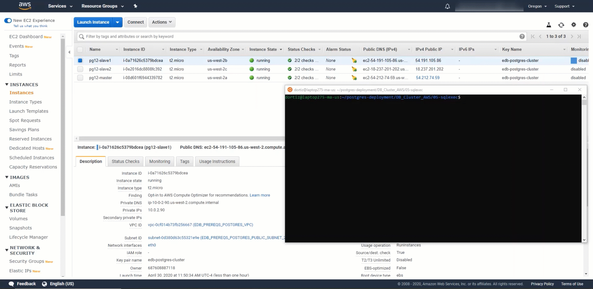

# Getting Started
Postgres Deployment scripts are an easy way to deploy Postgres and EDB Tools at no charge. It is a contribution by the EDB team members which can help people explore both Postgres and EDB tools. Users can interact via the git repository comments section. Feel free to leave comments there. However, these scripts are not officially supported by the EnterpriseDb Team.

EnterpriseDb has the largest base of PostgreSQL experts available.

Learn more about [Professional Support] (https://www.enterprisedb.com/services/ongoing-postgresql-help/postgresql-technical-support)

The intention of this repository is as an introductory self starting guide.

Before starting to delve into this repository, it is best to get familiar with the steps in the deployment process towards Amazon Web Services.

## The overall process consists of the following steps:

1. Set up Software Prerequisites
   * Accomplished manually
   * Requires configuration of AWS Command Line Interface for authentication towards AWS
   * [Configuring the AWS CLI]
(https://docs.aws.amazon.com/cli/latest/userguide/cli-chap-configure.html)
2. Set up AWS Prerequites resources
   * Performed by Terraform scripts in "01-prerequisites" folder
3. Set up AWS EC2 Instances and dependencies
   * Perform by Terraform scripts in "02-cluster" folder
4. Install Postgres on AWS EC2 Instances
   * Performed by Ansible scripts in "03-install" folder
4. Configure Postgres Replication on AWS EC2 Instances
   * Performed by Ansible scripts in "04-replication" folder
5. Execute SQL Scripts
   * Performed by Ansible scripts in "05-sqlexec" folder
----
### Demo Tutorials
* [Prerequisites Video - 01-prereqs](06-demos/) 
* [Cluster Video - 02-Cluster](06-demos/) 
* [Postgres Install Video - 03-Install](06-demos/) 
* [Postgres Replication Configuration Video - 04-01-Replication_Configuration](06-demos/) 
* [Postgres Replication Verification Video - 04-02-Replication_Verification](06-demos/) 
* [Postgres SQL Exec Video - 05-SQLExec](06-demos/) 


----
### Skipping Steps
* If you already have AWS resources matching the ```AWS Prerequisites Setup``` step you can skip to the ```Set up AWS EC2 Instances``` step.
* If you already have AWS resources matching the ```AWS Prerequisites``` step and the ```Set up AWS EC2 Instances``` step you can skip to the ```Install Postgres on AWS EC2 Instances``` step.
* If you already have AWS resources matching the ```AWS Prerequisites```, ```Set up AWS EC2 Instances```, and the ```Install Postgres on AWS EC2 Instances``` step you can skip to the ```Configure Replication on AWS EC2 Instances``` step.

----
### Software Prerequisites
1. Terraform installed
2. Ansible installed

**Require Manual Installation**

* [Terraform Installation]  (https://learn.hashicorp.com/terraform/getting-started/install.html)

* [Ansible Installation] (https://docs.ansible.com/ansible/latest/installation_guide/intro_installation.html)

### AWS Prerequisites Setup
##### Dependencies
1. Terraform

### Components
1. 1 VPC in your AWS account
2. Minimum of 3 Subnets with Public IP enabled
3. 1 S3 bucket with a folder

**Steps**

* Terraform must be initialized

* Navigate to the **01-prereqs** folder

* Set variables in the **```variables.tf```** file

* Variables to set:

   * ```user_name``` - Name for the AWS IAM role

   * ```aws_bucket_name``` - Name for the AWS Bucket
Name

   * ```aws_bucket_folder``` - Folder Name for the target AWS S3 Bucket

   * ```public_cidrblock``` - Public CIDR Block for AWS Resources

   * ```vpc_cidr_block``` - CIDR Block for the AWS VPC

   * ```public_subnet_1_cidr_block``` - CIDR Block for the AWS Public Subnet #1

   * ```public_subnet_2_cidr_block``` - CIDR Block for the AWS Public Subnet #2

   * ```public_subnet_3_cidr_block``` - CIDR Block for the AWS Public Subnet #3

* Create resources in AWS VPC with **terraform plan** or **terraform apply**

* AWS region must be provided when the **terraform plan** or **terraform apply** command are executed

* Create a folder with a name of your choice in the recently created bucket, example: ```wal```

**Terraform Commands**

Initialize terraform.

```
$ terraform init
```

Assess what resources will be created with this command.

```
$ terraform plan
```

Create the resources in AWS.

```
$ terraform apply
```

Verify which resources were created.

```
$ terraform show
```

To destroy resources recently created.

```
$ terraform destroy
```


### Set up AWS EC2 Instances
#### Dependencies
1. Terraform
2. AWS Prerequisites

### Components
1. 1 VPC in your AWS account
2. Minimum of 3 Subnets with Public IP enabled
3. 1 key pair to be created and downloaded as a .pem file locally
4. 1 S3 bucket with a folder

----
### Changing the Image from the current: CentOS 7 to a different image
* To change the image: Navigate to the ```DB_Cluster_AWS/02-cluster/EDB_CLUSTER_SETUP/environment/ec2/ec2.tf``` file
* Search for the ``` data "aws_ami" "centos_ami" { ``` text - Should be on line 10
* Locate the values text ``` "CentOS Linux 7 x86_64 HVM EBS*" ``` - Should be on line 18
* Change this text on line 18 to match the Image naming convention you seek to install
* Change the text to match the desired image on line 26 - ``` "CentOS Linux 7 x86_64 HVM EBS *"
* Determine if there is a need to change the text on 31 for the architecture type of the image
* Evaluate if there is a need to change the ``` root-device-type ``` on line 36

----
###

**Steps**

* Create a key pair in the AWS EC2 Console -> Services -> EC2 -> Network & Security -> Key Pairs -> Create key pair

* Copy the recently created key pair file to a location that will be utilized in the steps below

* Create a folder with a name of your choice in the AWS S3 Bucket recently created, example: ```wal```

* Terraform must be initialized

* Navigate to the **02-cluster** folder

* Set variables in the **```edb_cluster_input.tf```** file

* Variables to set:

   * ```vpc_id``` - VPC ID for the AWS VPC

   * ```subnet_id``` - The 3 Subnet ID's created by the ```AWS Prerequisites Step```

   * ```instance_type``` - Instance Types for the target AWS EC2 Instances

   * ```s3bucket``` - AWS S3 Bucket Name and folder

   * ```ssh_keypair``` - Name of the downloaded AWS EC2 Keypair File created in the AWS Console. Excluding path and ```.pem``` extension

   * ```ssh_key_path``` - Full path of the downloaded AWS EC2 Keypair File. Must include the name of the key pair file and extension.

   * ```db_engine``` - Postgres Database Engine Version to be installed. Examples: ```epas10, epas11, epas12, pg10, pg11 or pg12```

   * ```replication_type``` - Postgres Replication to be configured: ```synchronous``` or ```asynchronous```

* Create resources in AWS VPC with **terraform plan** or **terraform apply**

**Terraform Commands**

Initialize terraform.

```
$ terraform init
```

Assess what resources will be created with this command.

```
$ terraform plan
```

Create the resources in AWS.

```
$ terraform apply
```

Verify which resources were created.

```
$ terraform show
```

To destroy resources recently created.

```
$ terraform destroy
```

### Install Postgres on AWS EC2 Instances
#### Dependencies
1. Terraform
2. AWS Prerequisites
3. Ansible

### Components
1. 1 VPC in your AWS account
2. Minimum of 3 Subnets with Public IP enabled
3. 1 key pair to be created and downloaded as a .pem file locally
4. 1 S3 bucket with a folder
5. Previously existing Security Group for EC2 Instances with Inbound and Outbound Rules

**Steps**

* Navigate to the **03-install** folder

* Set parameters in the **```hosts.yml```** file

* Variables to set:

   * ```master``` - Allows for multiple masters and standbys. Options are: master, standby1, standby2, etc...

   * ```public_ip``` - The Public IP Address for the instance to install upon. Available on the AWS EC2 console.

* Ansible command line parameters to set:

   * ```OS``` - Supporting: Ubuntu18, Debian10 or CentOS7

   * ```PG_VERSION``` - Versions supported: Ubuntu18-10, 11 and 12, Debian10-10 and CentOS7-10, 11 and 12.

* Example of ansible command line parameters:

   * sudo ansible-playbook playbook.yml -u centos --private-key 'edb-postgres-cluster.pem' --extra-vars="OS=CentOS7 PG_VERSION=10"

   * sudo ansible-playbook playbook.yml -u centos --private-key 'edb-postgres-cluster.pem' --extra-vars="OS=CentOS7 PG_VERSION=11"

   * sudo ansible-playbook playbook.yml -u centos --private-key 'edb-postgres-cluster.pem' --extra-vars="OS=CentOS7 PG_VERSION=12"

### Verify which resources were created
1. ssh into any given EC2 instance of the cluster
2. Search for the pgsql-xx folder under /usr


### Configure Postgres Replication on AWS EC2 Instances
##### Dependencies
1. Ansible
2. AWS Prerequisites
3. Postgres AWS EC2 Instances
4. Install Postgres on AWS EC2 Instances

### Components
1. 1 VPC in your AWS account
2. Minimum of 3 Subnets with Public IP enabled
3. 1 key pair to be downloaded as a .pem file locally
4. 1 S3 bucket with a folder
5. Previously existing Security Group for EC2 Instances with Inbound and Outbound Rules
6. 3 AWS EC2 Instances 

### Postgres Archiving towards AWS S3 Bucket
In order for Archiving to be supported for archiving, either for archiving storage or retrieval the following steps must be followed:
1. [Install the AWS CLI] (https://docs.aws.amazon.com/cli/latest/userguide/cli-chap-install.html)
2. [Configuring the AWS CLI] (https://docs.aws.amazon.com/cli/latest/userguide/cli-chap-configure.html)
3. Update the roles/tasks/setup-xxxxxxx.yml matching your OS and Postgres Version for Master and Standby.
   Search for 'aws' and uncomment the commented lines
4. Execute the Postgres ```Configure Postgres Replication on AWS EC2 Instances``` step

**Steps**

* Navigate to the **04-replication** folder

* Create and set parameters in the **```hosts```** file

* Variables to set in hosts.yml file:

   * master:

     * ```node_type``` - 'master' or 'standby'. 'standby' should be suffixed with node number, ex.: 'standby1'

     * ```private_ip1``` - Private IP Address for Master Node

     * ```private_ip2``` - Private IP Address for Standby Node 1

     * ```private_ip3``` - Private IP Address for Standby Node 2

     * ```public_ip``` - Public IP for Master Node

     * ```pgdbuser``` - Postgres Database User Account

     * ```dbpassword``` - Postgres Database Password for Postgres Database User Account

     * ```edbrepuser``` - Postgres Database Replication User Account

     * ```replication_user_password``` - Password for Replication User Account

     * ```replication_type``` - 'synchronous' or 'asynchronous'

     * ```s3bucket``` - AWS S3 Bucket utilized for Write Access Log Archiving

   * standby1..x:

     * ```node_type``` - 'standby'

     * ```private_ip1``` - Private IP Address for Standby Node 1. Used for replication.

     * ```private_ip2``` - Private IP Address for Standby Node 2. Used for replication.

     * ```public_ip``` - PUblic IP Address for Node

* Ansible command line parameters to set:

   * ```OS``` - Supporting: CentOS7

   * ```PG_VERSION``` - Versions supported: 10, 11 and 12.

* Example of ansible command line parameters:

   * sudo ansible-playbook playbook.yml -u centos --private-key 'edb-postgres-cluster.pem' --extra-vars="OS=CentOS7 PG_VERSION=10"

   * sudo ansible-playbook playbook.yml -u centos --private-key 'edb-postgres-cluster.pem' --extra-vars="OS=CentOS7 PG_VERSION=11"

   * sudo ansible-playbook playbook.yml -u centos --private-key 'edb-postgres-cluster.pem' --extra-vars="OS=CentOS7 PG_VERSION=12"

### Verify which resources were created
1. ssh into the AWS EC2 Master Node of the Postgres Database Cluster
2. Login as postgres user
3. Login into psql
4. Verify that there are no Tables existing
5. Create a table
6. Insert records into table
7. ssh into AWS EC2 Standby Node of the Postgres Database Cluster
8. Login as postgres user
9. Login into psql
10. Select records from created table in Master Node
