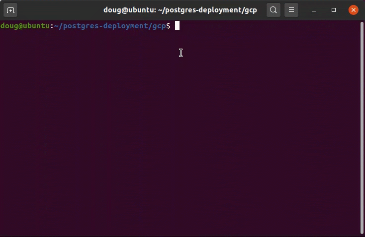

# Getting Started
Postgres Deployment scripts are an easy way to deploy Postgres and EDB Tools at no charge. It is a contribution by the EDB team members which can help people explore both Postgres and EDB tools. Users can interact via the git repository comments section. Feel free to leave comments there. However, these scripts are not officially supported by the EnterpriseDb Team.

EnterpriseDb has the largest base of PostgreSQL experts available.

Learn more about [Professional Support] (https://www.enterprisedb.com/services/ongoing-postgresql-help/postgresql-technical-support)

The intention of this repository is as an introductory self starting guide.

Before starting to delve into this repository, it is best to get familiar with the steps in the deployment process towards Amazon Web Services.

# Pre-Requisites:
1. Vendor Cloud SDK ( AWS, GCP or Azure )
2. Packages: curl and wget
1. Terraform >= 0.13
2. Ansible >= 2.9

# INSTALLATION

* The dependent packages are:
  * curl, wget, curl, terraform and ansible
  * To install Terraform: **[Installing Terraform](https://learn.hashicorp.com/tutorials/terraform/install-cli)**
  * To install Ansible: **[Installing Ansible](https://docs.ansible.com/ansible/latest/installation_guide/intro_installation.html)**
  * An example script is provided that is located at: ```./lib/prereqs.sh```

* A CLI or SDK depending on the Cloud vendor to utilize is required: 
  * To install the AWS CLI please refer to: **[Installing the AWS CLI](https://docs.aws.amazon.com/cli/latest/userguide/cli-chap-install.html)**
  * To install the AZURE CLI please refer to: **[Installing the AZURE CLI](https://docs.microsoft.com/en-us/cli/azure/install-azure-cli?view=azure-cli-latest)**
  * To install the Google Cloud SDK please refer to: **[Installing the Google Cloud SDK](https://cloud.google.com/sdk/docs/downloads-interactive)**

## USAGE:
* The EDB Deployment CLI is available by typing: ```./edb-deployment``` and pressing the **Enter** button.
  * Below are the available subcommands displayed when executed.

```
    aws-server      [create|destroy]  PROJECT_NAME
edb-deployment [<cloud>-server|<cloud>-postgres] [OPTION]...

EDB deployment script for aws, azure and gcp

Subcommands:
    aws-server      [create|destroy]  PROJECT_NAME
    azure-server    [create|destroy]  PROJECT_NAME
    gcloud-server   [create|destroy]  PROJECT_NAME
    aws-postgres    install           PROJECT_NAME
    azure-postgres  install           PROJECT_NAME
    gcloud-postgres install           PROJECT_NAME

Other Options:
    -h, --help Display help and exit
```

* Create your SSH Key or make it available for its reference
  
  
* Utilizing the EDB CLI for a Postgres Installation
  * Create the Infrastructure in your Cloud Vendor:
```
    ./edb-deployment aws-server      create  PROJECT_NAME
    ./edb-deployment azure-server    create  PROJECT_NAME 
    ./edb-deployment gcloud-server   create  PROJECT_NAME
```

  * Install and configure EDB Postgres  in your Cloud Vendor:
```
    ./edb-deployment aws-postgres      install  PROJECT_NAME
    ./edb-deployment azure-postgres    install  PROJECT_NAME 
    ./edb-deployment gcloud-postgres   create  PROJECT_NAME
```

  * Create the Infrastructure in your Cloud Vendor:
```
    ./edb-deployment aws-server      destroy  PROJECT_NAME
    ./edb-deployment azure-server    destroy  PROJECT_NAME 
    ./edb-deployment gcloud-server   destroy  PROJECT_NAME
```

# Demos:
* AWS
* AZURE
* GCLOUD

# LICENSE
Original work Copyright 2019-2020, EnterpriseDB Corporation

All rights reserved.

Redistribution and use in source and binary forms, with or without
modification, are permitted provided that the following conditions are 
met:

1. Redistributions of source code must retain the above copyright 
notice, this list of conditions and the following disclaimer.

2. Redistributions in binary form must reproduce the above copyright 
notice, this list of conditions and the following disclaimer in the 
documentation and/or other materials provided with the distribution.

3. Neither the name of EnterpriseDB nor the names of its contributors 
may be used to endorse or promote products derived from this software 
without specific prior written permission.

THIS SOFTWARE IS PROVIDED BY THE COPYRIGHT HOLDERS AND CONTRIBUTORS "AS 
IS" AND ANY EXPRESS OR IMPLIED WARRANTIES, INCLUDING, BUT NOT LIMITED 
TO, THE IMPLIED WARRANTIES OF MERCHANTABILITY AND FITNESS FOR A 
PARTICULAR PURPOSE ARE DISCLAIMED. IN NO EVENT SHALL THE COPYRIGHT OWNER OR CONTRIBUTORS BE LIABLE FOR ANY DIRECT, INDIRECT, INCIDENTAL, 
SPECIAL, EXEMPLARY, OR CONSEQUENTIAL DAMAGES (INCLUDING, BUT NOT 
LIMITED TO, PROCUREMENT OF SUBSTITUTE GOODS OR SERVICES; LOSS OF USE, 
DATA, OR PROFITS; OR BUSINESS INTERRUPTION) HOWEV
ER CAUSED AND ON ANY THEORY OF LIABILITY, WHETHER IN CONTRACT, STRICT LIABILITY, OR TORT 
(INCLUDING NEGLIGENCE OR OTHERWISE) ARISING IN ANY WAY OUT OF THE USE

# SUPPORT
Postgres Deployment scripts are an easy way to deploy Postgres and EDB tools at no charge. It is a contribution by the EDB team members which can help people explore both Postgres and EDB tools. Users can interact via the git repository comments section so feel free to leave comments there; however, these scripts are not officially supported by the EnterpriseDB team.
EnterpriseDB has the largest base of PostgreSQL experts available. Learn more about Professional Support.
