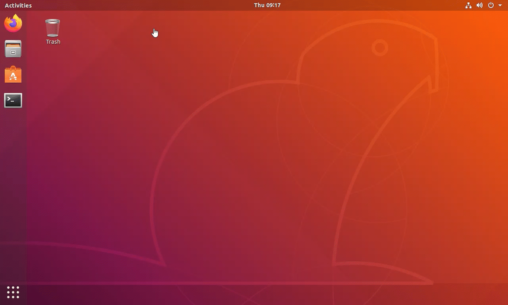
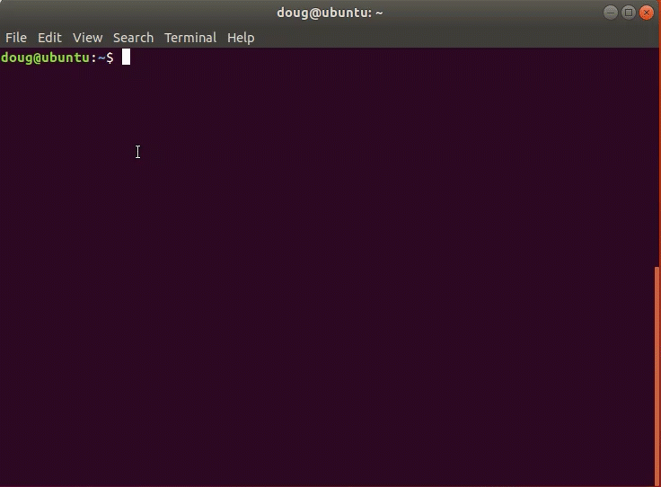

# Getting Started
Postgres Deployment scripts are an easy way to deploy Postgres and EDB Tools at no charge. It is a contribution by the EDB team members which can help people explore both Postgres and EDB tools. Users can interact via the git repository comments section. Feel free to leave comments there. However, these scripts are not officially supported by the EnterpriseDb Team.

EnterpriseDB has the largest base of PostgreSQL experts available.

Learn more about [Professional Support] (https://www.enterprisedb.com/services/ongoing-postgresql-help/postgresql-technical-support)

The intention of this repository is as an introductory self starting guide for setting up the prerequisites needed to install and configure Postgres or EnterpriseDB Postgres Advanced Server in GCP.

Before starting to delve into this repository, it is best to get familiar with the steps in the deployment process towards GCP.

## The overall process consists of the following steps:

1. Set up Software Prerequisites
   * Accomplished manually
   * Requires configuration of GCP Cloud SDK for authentication towards GCP
   * [Installing GCloud SDK] (https://cloud.google.com/sdk/docs/downloads-interactive)
   * [Terraform Installation]  (https://learn.hashicorp.com/terraform/getting-started/install.html)

----
### Supported Operating Systems
* Centos 7
* RedHat 7

----
### Software Prerequisites
1. GCloud SDK
2. Terraform >= 0.13

**Require Manual Installation**
* [Installing GCloud SDK] (https://cloud.google.com/sdk/docs/downloads-interactive)
* [Service Account JSON Credentials file] (https://cloud.google.com/iam/docs/creating-managing-service-account-keys)
* [Terraform Installation]  (https://learn.hashicorp.com/terraform/getting-started/install.html)
* Download the Code for this repository by navigating to the top of this page and clicking on: **Code** Green Button -> **Download ZIP** Link
* Open the ```Terminal``` command line
* Navigate to the extracted folder location and type: ```cd postgres-deployment/DB_Cluster/gcp/01-terraform-ansible``` finishing with pressing the **Enter** button

----
### Prerequisites Setup and configuration
##### Dependencies
* GCloud SDK Installation
  
* GCP Service Account JSON Credentials File Generation
  
* GCloud SDK Login
  
* GCloud SDK Reinit 
  
* Terraform 0.13 Installation 
  
* Download the Code for this repository by navigating to the top of this page and clicking on: **Code** Green Button -> **Download ZIP** Link
* Open the ```Terminal``` command line
* Navigate to the extracted folder location and type: ```cd postgres-deployment/DB_Cluster/gcp/01-terraform-ansible``` finishing with pressing the **Enter** button

----
### Prerequisites Setup

**Steps**

* Download the Code for this repository by navigating to the top of this page and clicking on: **Code** Green Button -> **Download ZIP** Link

* Open the ```Terminal``` command line

* Navigate to the extracted folder location and type: ```cd postgres-deployment/DB_Cluster/gcp/01-terraform-ansible``` finishing with pressing the **Enter** button

* Terraform must be initialized

* Set variables in the **```variables.tf```** file according to your desired configuration

* Variables to set:

   * ```credentials``` - Path and location of the ```account.json``` file that holds GCP credentials, example ```~/account.json```
   * ```project_name``` - Name of the Google Cloud Project in which resources will be created
   * ```subnetwork_region``` - Location for the resources to be created, options: ```'us-central1','us-east1', 'us-east4', 'us-west1', 'us-west2', 'us-west3' and 'us-west4'```
   * ```ssh_key_location``` - Location for previously created public key, example: ```~/id_rsa.pub```
   * ```instance_count``` - Initially set to 3, if more are needed set the ```instance_count``` to the desired instance count and perform a **terraform apply**

* Review the naming conventions utilized in the **```variables.tf```** file and update accordingly

* Before applying the changes you can preview those changes with **terraform plan**

* Create resources in Account with **terraform apply**

* The variables listed above must be provided when the **terraform plan** or **terraform apply** command are executed

Once the terraform apply has completed you should see a list resources under your ```Project``` that resemble the list below:
* 1 Project for your resources to be deployed into
* 1 VPC Network
* 1 Firewall with Rules
* 3 Virtual Machines


**Terraform Commands**

Initialize terraform.

```
$ terraform init
```

Assess what resources will be created with this command.

```
$ terraform plan
```

Create the resources.

```
$ terraform apply
```

Verify which resources were created.

```
$ terraform show
```

To destroy resources recently created.

```
$ terraform destroy
```

----
### Verify which resources were created
1. Login into the [GCP Console]  (https://console.cloud.google.com)
2. Locate and click the ```Go to project settings``` within your **Home -> Dashboard**
3. Locate the desired resources to view under their section
