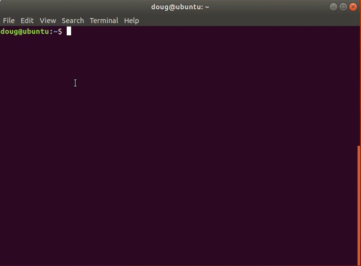

# Getting Started
Postgres Deployment scripts are an easy way to deploy Postgres and EDB Tools at no charge. It is a contribution by the EDB team members which can help people explore both Postgres and EDB tools. Users can interact via the git repository comments section. Feel free to leave comments there. However, these scripts are not officially supported by the EnterpriseDb Team.

EnterpriseDb has the largest base of PostgreSQL experts available.

Learn more about [Professional Support] (https://www.enterprisedb.com/services/ongoing-postgresql-help/postgresql-technical-support)

The intention of this repository is as an introductory self starting guide.

Before starting to delve into this repository, it is best to get familiar with the steps in the deployment process towards Amazon Web Services.

## The overall process consists of the following steps:

1. Set up Software Prerequisites
   * Linux based Operating System
   * Package dependencies installation are accomplished via bash script
   * GCP SDK installed via bash script
   * Requires configuration of GCP SDK for authentication
2. Configure GCP SDK with credentials
3. Create your SSH Private and Public Key with proper permissions
4. Create Cloud Infrastructure Prerequisites Resources
   * Performed by Terraform scripts in ```01-terraform``` folder
5. Setup Postgres or EnterpriseDB Postgres Advanced Server
   * Performed by Ansible scripts in Ansible Galaxy downloaded collection: ```edb_devops.edb_postgres```

----
### Software Prerequisites
1. Terraform installed and configured
2. Ansible installed and configured

**Require Installation**

* [Terraform Installation]  (https://learn.hashicorp.com/terraform/getting-started/install.html)
  

* [Ansible Installation] (https://docs.ansible.com/ansible/latest/installation_guide/intro_installation.html)

### Prerequisites Setup
##### Dependencies
1. Vendor Cloud SDK ( AWS, GCP or Azure )
2. Packages: curl and wget
1. Terraform >= 0.13
2. Ansible >= 2.9

### Steps

* Download ```postgres-deployment``` github repo by clicking on the green **Code** button followed by clicking the **Download Zip** link

* Copy the ```postgres-deployment``` downloaded zip file to the desired target directory
  
* Extract the zip file to a desired destination by utilizing Archive Manager or by: typing ```unzip postgres-deployment.zip``` and pressing the **Enter** button

* Open the ```Terminal``` command line

* Navigate to the extracted folder location and type: ```cd postgres-deployment/gcp``` finishing with pressing the **Enter** button

* Items to consider:
  * The Operating Systems Images ( CentOS7 and RHEL7 ) are supported across the following Google Cloud Locations: centralus, eastus, eastus2, westus, westcentralus, westus2, northcentralus and southcentralus
  * A minimum of 3 instances is recommended

* The bash scripts utilized in the scripts have been tested on:
  * Red Hat 7
  * CentOS 7
  * Debian 9
  * Ubuntu 20.04

* Create your Public and Private Keys
  * Type: ```ssh-keygen``` and press the **Enter** button
  * Follow the instructions to create the private and public keys

* Set the permissions for private and public key
  * Type: ```chmod 400 ~/.ssh/id_rsa*.* and press the **Enter** button
  * This command assumes you have named your keys: ```id_rsa```

* Download your Google Cloud JSON File Credentials
  * Navigate to the Google Cloud Platform Console
  * Click on **IAM & Admin** -> **Service Accounts**
  * Select the Service Account -> Click the ellipsis menu button -> **Create key**
  * Select the Key Type: **JSON** --> **Create Button**
  * Rename the downloaded JSON Credentials File to something relatively easy to type
  

* Type: ```./prereqs.sh``` and execute the bash script by pressing the **Enter** button

* Type: ```./gcp-sdk.sh``` and execute the bash script by pressing the **Enter** button.
  * The results should be similar as the video below:
  
  

* Type: ```./pre-setup.sh``` and execute the bash script by pressing the **Enter** button and provide the answers to the prompts. The script will await until the instances are available.

* **Allow for the instances creation to complete ( times will vary depending on amount of instances and instance types ). Once completed, proceed to the next step**

* Type: ```./pg-setup.sh``` and execute the bash script by pressing the **Enter** button and provide the answers to the prompts
