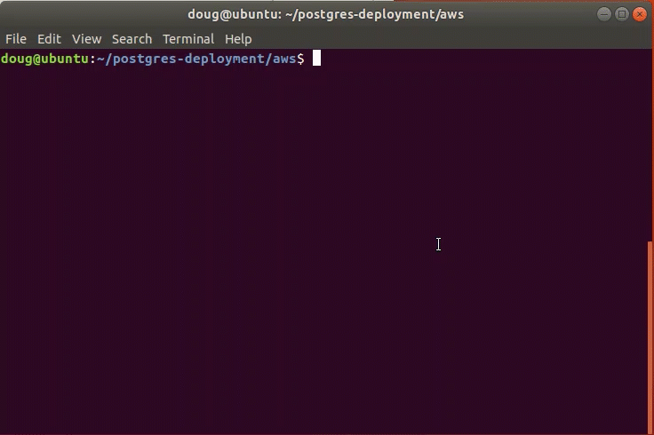
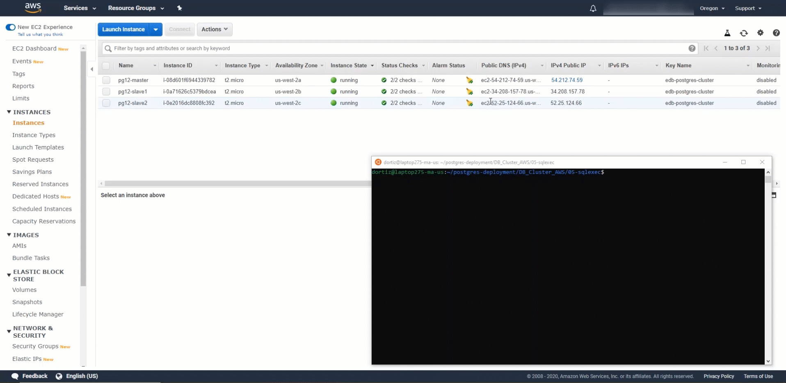

# Getting Started
Postgres Deployment scripts are an easy way to deploy Postgres and EDB Tools at no charge. It is a contribution by the EDB team members which can help people explore both Postgres and EDB tools. Users can interact via the git repository comments section. Feel free to leave comments there. However, these scripts are not officially supported by the EnterpriseDb Team.

EnterpriseDb has the largest base of PostgreSQL experts available.

Learn more about [Professional Support] (https://www.enterprisedb.com/services/ongoing-postgresql-help/postgresql-technical-support)

The intention of this repository is as an introductory self starting guide.

Before starting to delve into this repository, it is best to get familiar with the steps in the deployment process towards Amazon Web Services.

## The overall process consists of the following steps:

1. Set up Software Prerequisites
   * Linux based Operating System
   * Package dependencies installation are accomplished via bash script
   * AWS CLI v2 installed via bash script
   * Requires configuration of AWS Command Line Interface v2 for authentication
2. Configure AWS CLI v2 with credentials
3. Create Cloud Infrastructure Prerequisites Resources
   * Performed by Terraform scripts in ```terraform/aws``` folder
4. Setup Postgres or EnterpriseDB Postgres Advanced Server
   * Performed by Ansible scripts in Ansible Galaxy downloaded collection: ```edb_devops.edb_postgres```
5. Execute SQL Scripts
   * Performed by Ansible scripts in ```02-sqlexec``` folder

----
### Software Prerequisites
1. Terraform installed and configured
2. Ansible installed and configured

**Require Installation**

* [Terraform Installation]  (https://learn.hashicorp.com/terraform/getting-started/install.html)
  

* [Ansible Installation] (https://docs.ansible.com/ansible/latest/installation_guide/intro_installation.html)

### Prerequisites Setup
##### Dependencies
1. Vendor Cloud SDK ( AWS, GCP or Azure )
2. Packages: curl and wget
1. Terraform >= 0.13
2. Ansible >= 2.9

### Steps

* Items to consider:
  * The Operating Systems Images ( CentOS7 and RHEL7 ) are supported across the following AWS Regions: 'us-east-1', 'us-east-2', 'us-west-1'or 'us-west-2'
  * A minimum of 3 instances is recommended

* The bash scripts utilized in the scripts have been tested on:
  * Red Hat 7
  * CentOS 7
  * Debian 9
  * Ubuntu 20.04

* Create your SSH Key or make it available for its reference
  

* The dependent packages are:
  * curl, wget, curl, terraform and ansible
  * An example script is provided that is located at: ```./lib/prereqs.sh```

* A CLI or SDK depending on the Cloud vendor to utilize is required: 
  * AWS - An example script is provided that is located at: ```./lib/aws-cli.sh```
  * Azure - An example script is provided that is located at: ```./lib/azure-cli.sh```
  * Google Cloud - An example script is provided that is located at: ```./lib/gcp-sdk.sh```

* Configure the CLI or SDK
  * AWS - ```aws configure``` and pressing **Enter** button
  * Azure - ```az login``` and pressing **Enter** button
  * Google Cloud - ```gcloud init``` and pressing **Enter** button
  
* Download ```postgres-deployment``` github repo by clicking on the green **Code** button followed by clicking the **Download Zip** link

* Extract the zip file to a desired destination

* Copy the ```postgres-deployment.zip``` file to the desired target directory
  
* Extract the zip file to a desired destination by utilizing Archive Manager or by: typing ```unzip postgres-deployment.zip``` and pressing the **Enter** button
 
* Open the ```Terminal``` command line

* Navigate to the extracted folder location and type: ```cd postgres-deployment``` finishing with pressing the **Enter** button

* Type: ```./lib_sh/keygen.sh``` and execute the bash script by pressing the **Enter** button.
  

* Type: ```./edb-deployment``` and execute the command by pressing the **Enter** button. The subcommands below will be listed as options:

```
edb-deployment [<cloud>-server|<cloud>-postgres] [OPTION]...

EDB deployment script for aws, azure and gcp

Subcommands:
    aws-server      [create|destroy]  PROJECT_NAME
    azure-server    [create|destroy]  PROJECT_NAME
    gcloud-server   [create|destroy]  PROJECT_NAME
    aws-postgres    install           PROJECT_NAME
    azure-postgres  install           PROJECT_NAME
    gcloud-postgres install           PROJECT_NAME

Other Options:
    -h, --help Display help and exit
```
* Type: ```./edb-deployment aws-server create PROJECT_NAME``` and execute the command by pressing the **Enter** button.
  

* Type: ```./edb-deployment aws-postgres install PROJECT_NAME``` and execute the command by pressing the **Enter** button.
  

* Type: ```./edb-deployment aws-server destroy PROJECT_NAME``` and execute the command by pressing the **Enter** button.
  

### Manual Configurations
* The steps below are for reference in case there is a desire to perform configurations manually. The steps are in listed and described in their execution order and are located in the ```lib_sh``` directory:
  * keygen.sh - Removes and creates the SSH Keys
  
  * aws-cli.sh - Installs AWS CLI and initiates the AWS Credentials Configuration
   The results should be similar as the video below:
  
  * Configure the AWS CLI by typing: ```AWS configure``` and pressing **Enter** button
  
  
### Execute SQL Statements on Postgres Cluster
##### Dependencies
1. Ansible
2. Cloud Infrastructure Prerequisites
3. Previously setup and configured Postgres or EnterpriseDB Postgres Advanced Server Instances

**Steps**

* Navigate to the **sqlexec** folder

* Refer to the example files: ```hosts.yml``` and ```playbook.yml``` located in the ```sqlexec``` directory
  
